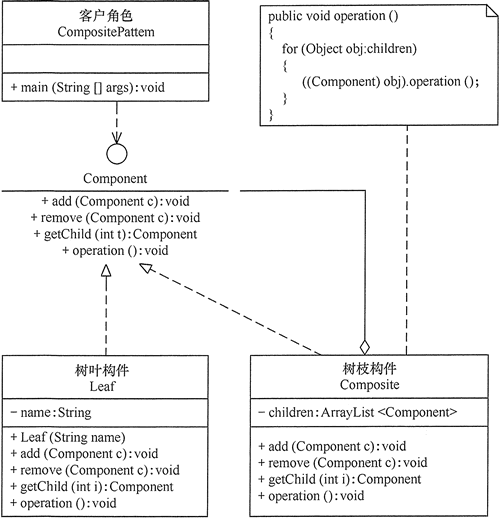
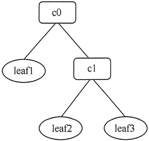

# 组合模式

组合模式的定义与特点
----------

组合（Composite）模式的定义：有时又叫作部分-整体模式，它是一种将对象组合成树状的层次结构的模式，用来表示“部分-整体”的关系，使用户对单个对象和组合对象具有一致的访问性。

组合模式的主要优点有：

1. 组合模式使得客户端代码可以一致地处理单个对象和组合对象，无须关心自己处理的是单个对象，还是组合对象，这简化了客户端代码；
2. 更容易在组合体内加入新的对象，客户端不会因为加入了新的对象而更改源代码，满足“开闭原则”；

其主要缺点是：

1. 设计较复杂，客户端需要花更多时间理清类之间的层次关系；
2. 不容易限制容器中的构件；
3. 不容易用继承的方法来增加构件的新功能；

组合模式的结构与实现
----------

组合模式的结构不是很复杂，下面对它的结构和实现进行分析。

#### 1\. 模式的结构

组合模式包含以下主要角色。

1. 抽象构件（Component）角色：它的主要作用是为树叶构件和树枝构件声明公共接口，并实现它们的默认行为。在透明式的组合模式中抽象构件还声明访问和管理子类的接口；在安全式的组合模式中不声明访问和管理子类的接口，管理工作由树枝构件完成。
2. 树叶构件（Leaf）角色：是组合中的叶节点对象，它没有子节点，用于实现抽象构件角色中 声明的公共接口。
3. 树枝构件（Composite）角色：是组合中的分支节点对象，它有子节点。它实现了抽象构件角色中声明的接口，它的主要作用是存储和管理子部件，通常包含 Add()、Remove()、GetChild() 等方法。

组合模式分为透明式的组合模式和安全式的组合模式。

(1) 透明方式：在该方式中，由于抽象构件声明了所有子类中的全部方法，所以客户端无须区别树叶对象和树枝对象，对客户端来说是透明的。但其缺点是：树叶构件本来没有 Add()、Remove() 及 GetChild() 方法，却要实现它们（空实现或抛异常），这样会带来一些安全性问题。其结构图如图 1 所示。

图1 透明式的组合模式的结构图

(2) 安全方式：在该方式中，将管理子构件的方法移到树枝构件中，抽象构件和树叶构件没有对子对象的管理方法，这样就避免了上一种方式的安全性问题，但由于叶子和分支有不同的接口，客户端在调用时要知道树叶对象和树枝对象的存在，所以失去了透明性。其结构图如图 2 所示。

图2 安全式的组合模式的结构图

#### 2\. 模式的实现

假如要访问集合 c0={leaf1,{leaf2,leaf3}} 中的元素，其对应的树状图如图 3 所示。

图3 集合c0的树状图

透明式的组合模式的实现代码如transparent/transparent.go所示。

安全式的组合模式的实现代码如safe/safe.go所示。